# How to use the HU SOGo calendar
The HU SOGo calendar is a calendar server hosted by CMS that lets us share our calendar with other people and schedule meetings with them. It is based on the SOGo calendar server, which is a free and open-source calendar server that supports the CalDAV protocol. This means that you can access your calendar from any calendar app that supports CalDAV, such as Outlook, Apple Calendar, or Thunderbird.

## 1. "Freischalten" (Activate)
Open your web browser and go to [kal.hu-berlin.de/freischaltung/](https://kal.hu-berlin.de/freischaltung/). 

Read and accept the terms and conditions, enter your CMS HU login credentials, and click on "Weiter" (Continue).
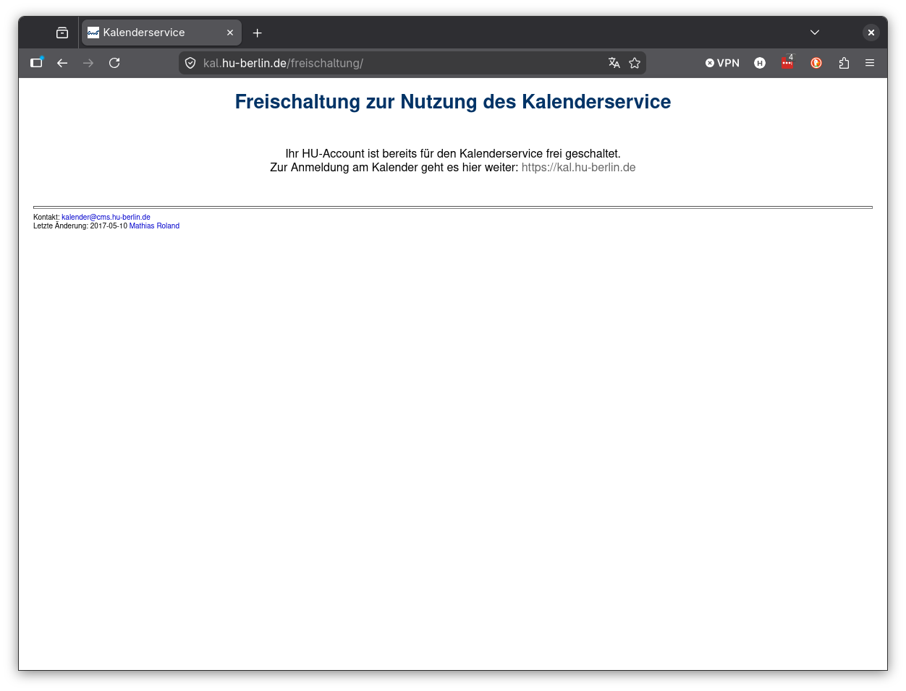

## 2. Navigate to kal.hu-berlin.de
Next, go to [kal.hu-berlin.de](https://kal.hu-berlin.de) and log in with your CMS HU credentials on the left side of the page.
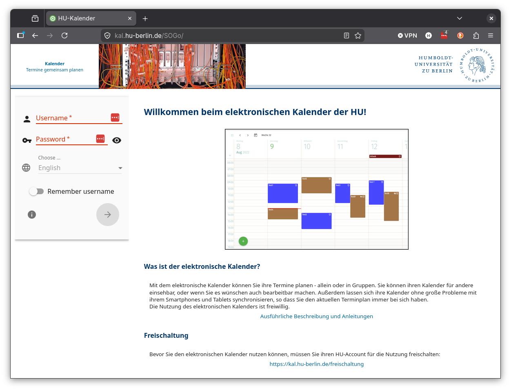

## 3. (Optional) Set default classification to "Confidential"
If you want to set the default classification for your calendar events to "Confidential", go to settings by clicking on the gear icon in the top left corner of the page. 
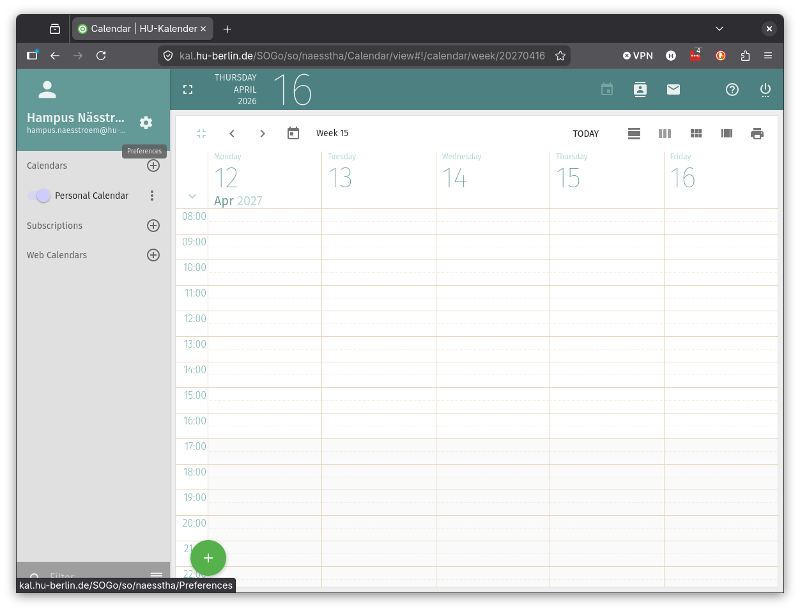

Then, select "Calendar" from the left menu and choose "Confidential" as the default classification for new events.
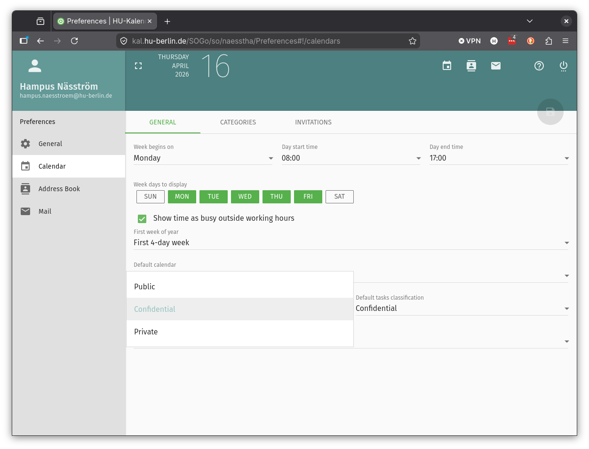

## 4. Make your busy status visible to others
To make your busy status visible to others, click the elipses icon (three dots) next to your "Personal Calendar".
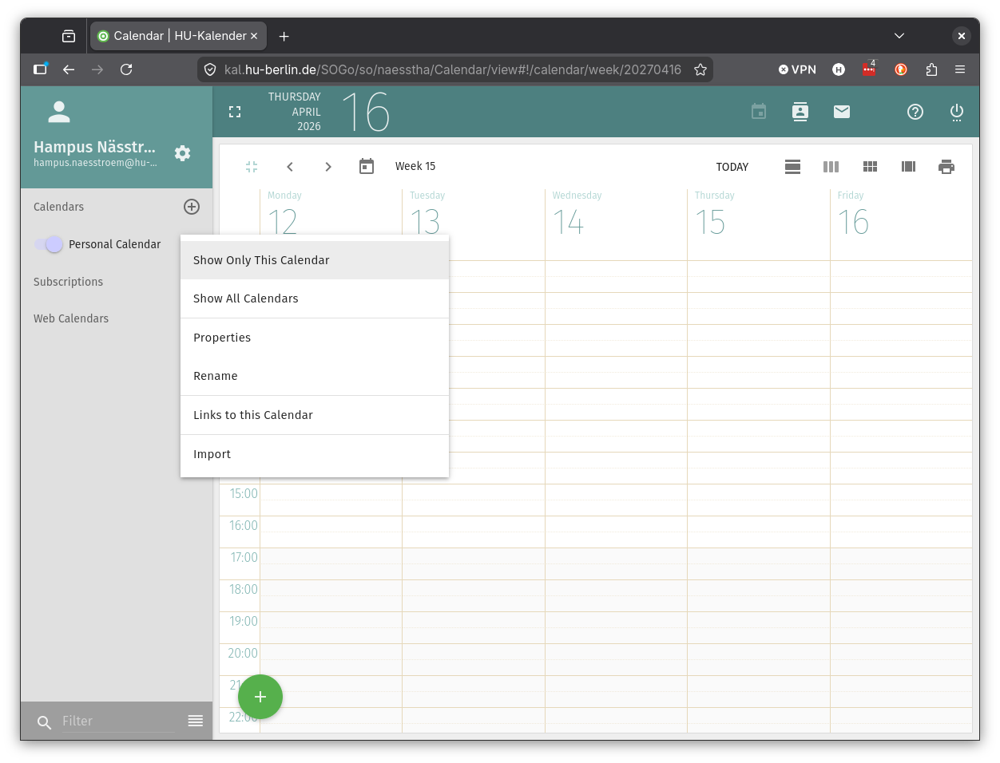

**Scroll down** (I know it's very stupid that you have to scroll) to the "Sharing..." option and click on it.
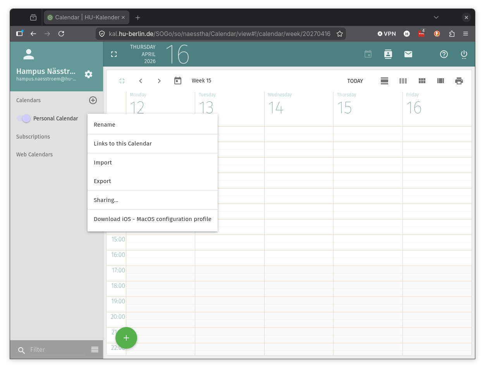

Click on "Any Authenticated User" and select "View the Date & Time" from the dropdown "Confidential" and "Public" menu. 
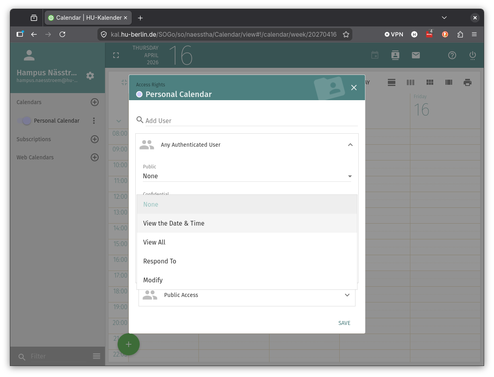

Then click "Save".
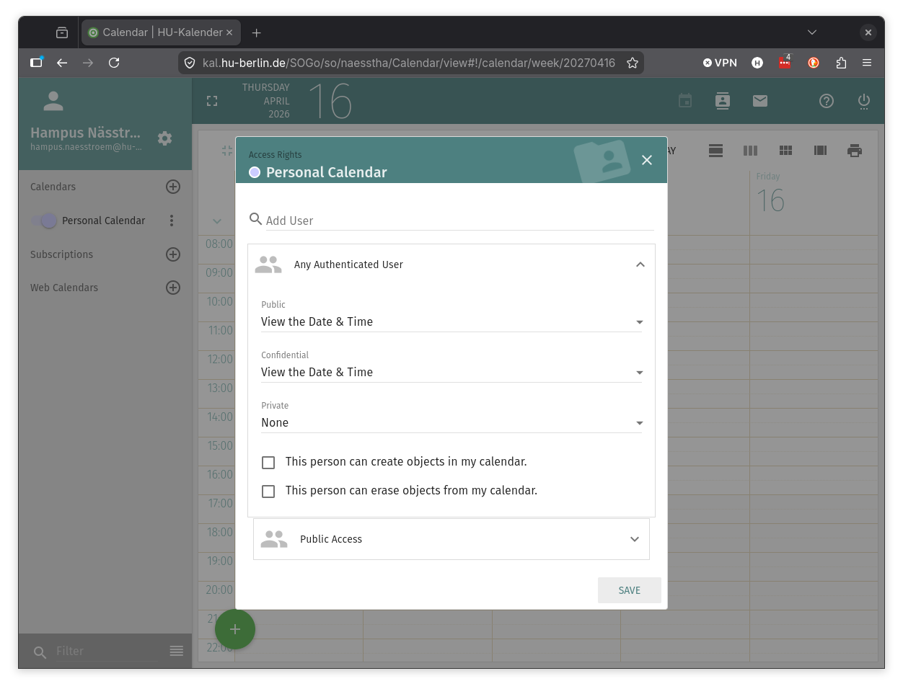

## 5. (Optional) Set up calendar sharing with specific people
If you want to share your calendar with specific people, click on the elipses icon (three dots) next to your "Personal Calendar", scroll down and select "Sharing..." from the dropdown menu again.
Search for the user by typing their name or email address in the "Add User" field and select the appropriate user from the search results.
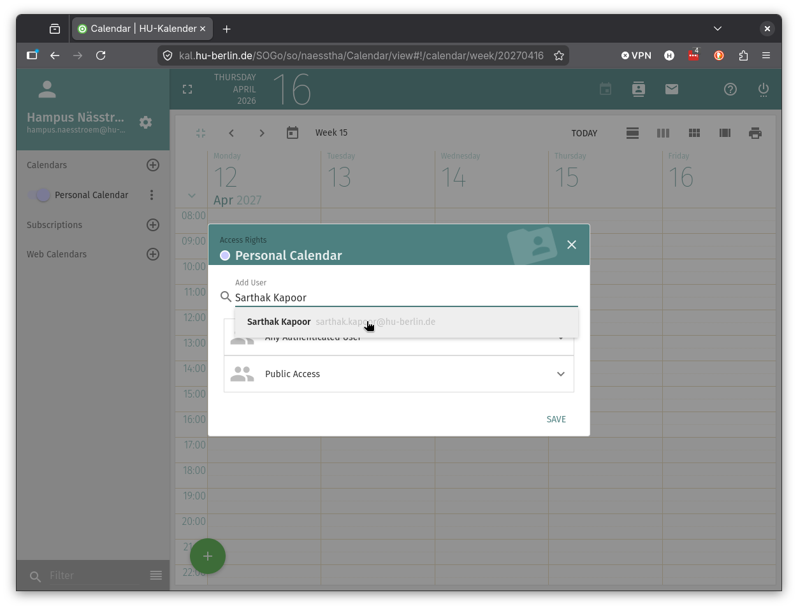

The settings from "Any Authenticated User" will be applied to the user you just added. You can change the settings for this specific user by clicking on the "Public", "Confidential", or "Private" dropdown menus and selecting the desired option.
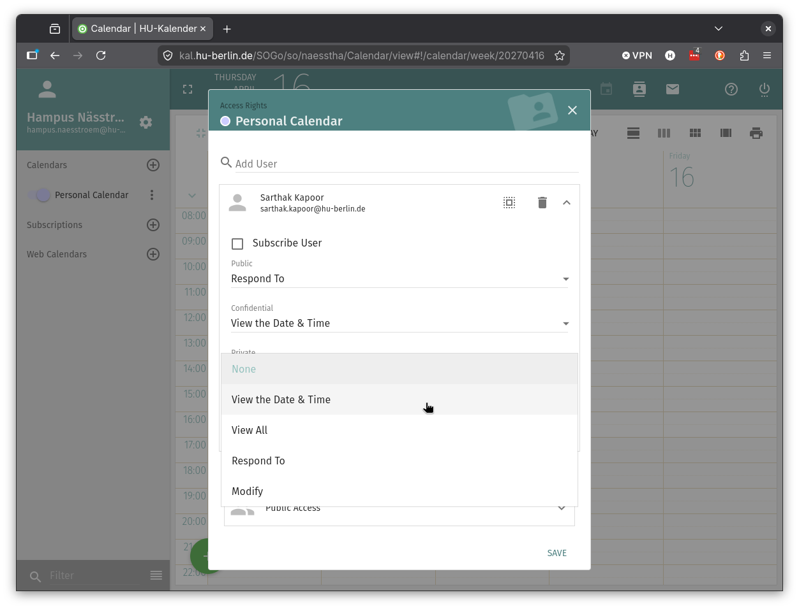

For more information on the different visibility options, please refer to the CMS Docs (only in German):[cms.hu-berlin.de/de/dl/kalender/sogo/](https://www.cms.hu-berlin.de/de/dl/kalender/sogo/index).
You can also reach this by clicking on the "?" icon in the top right corner of the page.

## 6. Add the calendar to your calendar app
To add your calendar to your calendar app, follow the instructions here for the different calendar apps:
- [Outlook](https://www.cms.hu-berlin.de/de/dl/kalender/sogo/caldavsync/index)
- [Apple Calendar](https://www.cms.hu-berlin.de/de/dl/kalender/sogo/sogo-kalender-unter-macos-und-ios)
- [Thunderbird](https://www.cms.hu-berlin.de/de/dl/kalender/sogo/sogo-mit-thunderbird)

## 7. Scheduling meetings with others
To schedule a new event, click on the green "+" button in the top bottom left corner and select"Create a new event". Add a title, date, time, and location for the event. You can also add a description and set the visibility of the event to "Public", "Confidential", or "Private".
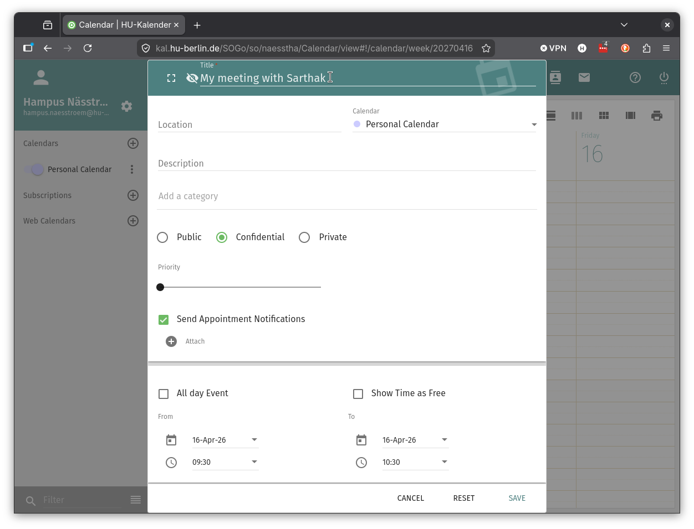

Scroll down and click on "Invite Attendees" to add attendees to the event. You can search for attendees by typing their name or email address in the "Invite Attendee" field and selecting the appropriate user from the search results. **Make sure to select the CMS account and not the physics one**.
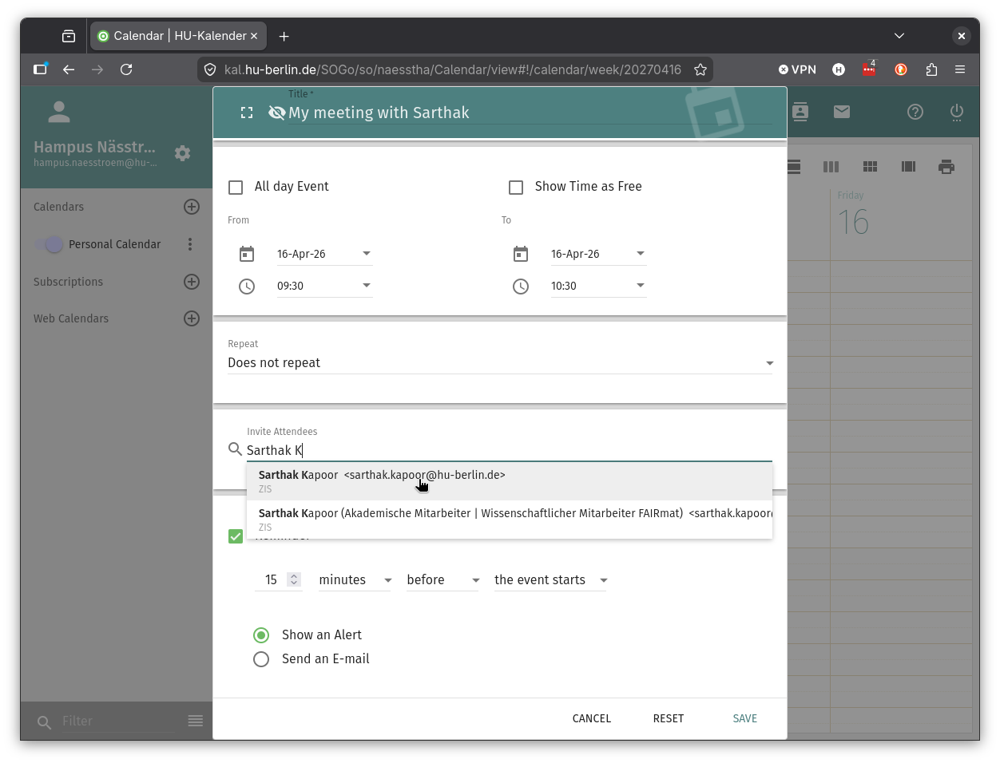

You can now see when all the attendees are available and schedule the event accordingly. Once you have set all the details, click on "Save" to create the event and send out invitations to the attendees.
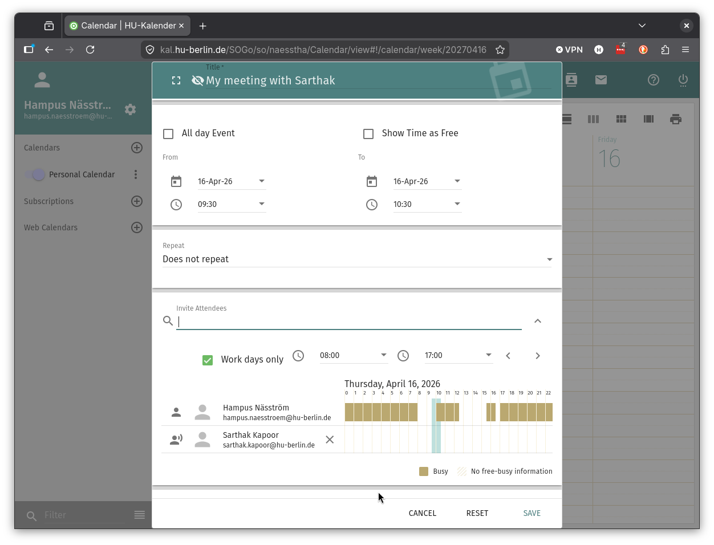