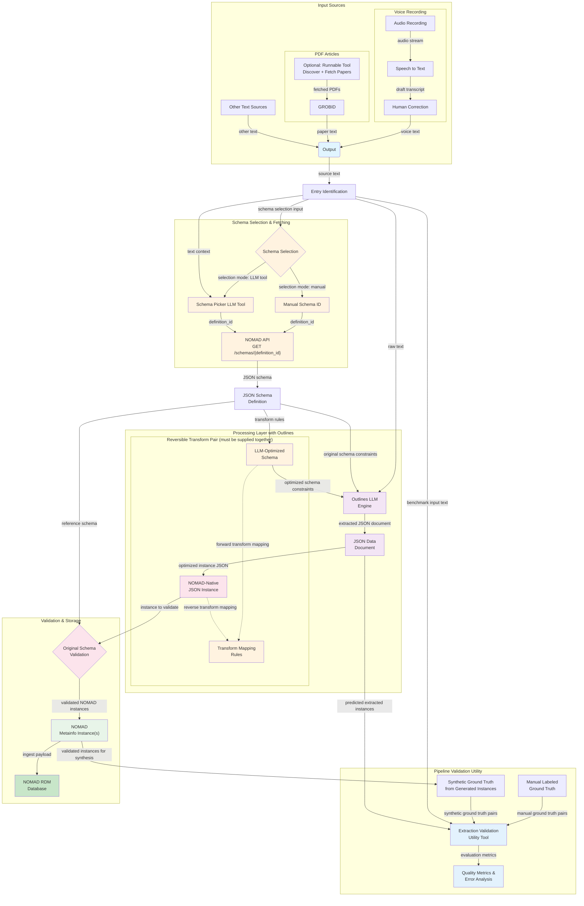

# NOMAD Data Parsing Pipeline

This document outlines the architecture for parsing data from various sources into NOMAD using LLM function calling to generate validated JSON documents.

## Pipeline Architecture



## Key Components

### Outlines Integration
**Outlines** is a library that enables constrained decoding for LLMs, ensuring generated output always validates against specified schemas without manual validation or retry loops. Benefits:
- **Guaranteed valid JSON**: Output always matches the target schema structure
- **Reduced API calls**: No need for validation failures and retries
- **Flexible schema support**: Works with JSON schemas, Pydantic models, and grammar constraints
- **Performance**: Efficient constraint-guided generation

### Input Sources
- **Voice Recordings Sub-pipeline**: Audio recording -> speech to text -> human correction -> voice text
- **PDF Articles Sub-pipeline**: Optional runnable paper discovery/fetch tool -> PDF to text and GROBID -> paper text
- **Other Text Sources**: Any additional unstructured text data

### Data Processing
1. **Raw Text Data**: Text extracted/transcribed from various sources
2. **Extraction Runs (1..N)**: A single raw text input can be split into multiple extraction runs, each targeting the same or different schema types
3. **Outlines LLM Engine**: Uses Outlines library to enforce structured generation with schema constraints, ensuring output always matches the target JSON schema. Outlines handles validation and retry logic automatically through constrained decoding.
4. **JSON Data Document(s)**: Guaranteed-valid output(s) per run that conform to the selected schema structure

### Schema Management
- **Schema Selection Options**:
    1. **Manual selection** by explicitly providing one or more `definition_id` values
    2. **LLM-based schema picker tool** that infers one or more schema candidates from input text and returns `definition_id` values
- **NOMAD API Integration**: Fetches JSON schema definitions dynamically from `GET /schemas/{definition_id}`
- **Optional Schema Optimization**: Applies reversible transformations to simplify schema complexity for better extraction quality (e.g., flattening deep nesting, narrowing enums, adding helper aliases)
- **Constraint Adaptation**: Converts optimized (or original) schemas to Outlines-compatible constraints

### Validation & Storage
1. **LLM Output Instance(s)**: Guaranteed-valid JSON against the optimized schema (or original schema when optimization is skipped), produced per run
2. **Reverse Transformation**: Deterministic mapping of generated instances back to the original NOMAD schema structure
3. **NOMAD Metainfo Instance(s)**: Reverted JSON loaded as NOMAD metainfo objects after original-schema validation
4. **RDM Database**: Final storage of one or multiple instances in NOMAD research data management system

### Extraction Validation Utility
- **Purpose**: Validate extraction quality independently from runtime schema validation
- **Ground truth option 1**: Manually labeled input/output pairs
- **Ground truth option 2**: Synthetic benchmark data generated from automatically produced validated instances
- **Evaluation**: Compare predicted outputs against ground truth and compute metrics (field-level accuracy, unit-conversion correctness, missing/extra fields)
- **Feedback loop**: Use error analysis to improve prompts, schema optimization rules, and mapping rules

## Concrete Example: Unit-Aware Reversible Transform

### 1) Original NOMAD-oriented schema (fixed storage unit in V)
```python
original_schema = {
    "type": "object",
    "properties": {
        "voltage": {"type": "number"}
    },
    "required": ["voltage"]
}
```

### 2) LLM-optimized schema (value + unit)
```python
optimized_schema = {
    "type": "object",
    "properties": {
        "voltage": {
            "type": "object",
            "properties": {
                "value": {"type": "number"},
                "unit": {"type": "string", "enum": ["V", "mV", "kV"]}
            },
            "required": ["value", "unit"]
        }
    },
    "required": ["voltage"]
}
```

### 3) LLM output instance (optimized format)
```json
{
  "voltage": {
    "value": 340,
    "unit": "mV"
  }
}
```

### 4) Reverse transform to NOMAD-native instance
Conversion rule for `voltage` (target unit: V):

$$
	ext{voltage\_V} = \text{value} \times \text{factor(unit}\rightarrow\text{V)}
$$

For `340 mV`, factor is $10^{-3}$, so:

$$
340 \times 10^{-3} = 0.34\,\text{V}
$$

Result posted to NOMAD:
```json
{
  "voltage": 0.34
}
```

### 5) Mapping metadata used by transformer
```python
mapping_rules = {
    "voltage": {
        "optimized_path": "voltage.value",
        "unit_path": "voltage.unit",
        "target_unit": "V",
        "allowed_units": ["V", "mV", "kV"]
    }
}
```

## Development Tasks

- [ ] Text extraction/transcription modules for each source type
- [ ] Manual schema selection input (pass-through `definition_id`)
- [ ] LLM schema picker tool (text -> `definition_id`)
- [ ] NOMAD API client for schema retrieval
- [ ] Outlines integration with JSON schema constraints
- [ ] Reversible schema optimizer (original schema -> optimized schema + mapping rules)
- [ ] Reverse instance transformer (optimized instance -> NOMAD-native instance)
- [ ] Schema-to-Outlines constraint generator to convert selected schema (optimized/original) to Outlines format
- [ ] LLM model selection and prompt engineering for information extraction
- [ ] Round-trip tests (schema optimize/revert and instance transform/revert)
- [ ] Extraction validation utility (dataset runner + comparator)
- [ ] Manual ground-truth dataset format and labeling guidelines
- [ ] Synthetic benchmark generator from validated generated instances
- [ ] Quality metrics dashboard/report (accuracy, completeness, unit normalization)
- [ ] Integration tests with NOMAD API
- [ ] Performance optimization for batch processing
- [ ] Monitoring and logging for extraction quality
