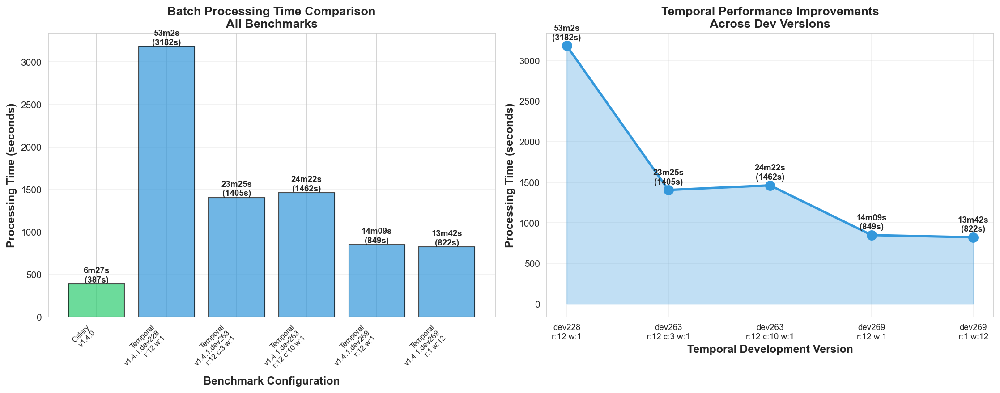

# Workflow Orchestration Benchmarks

## Performance Comparison

Here is a comparison of batch processing performance across different workflow orchestrators and configurations on my 12 core local machine when processing 10k small entries.

| **Orchestrator** | **Nomad Version** | **Replicas** | **Concurrency** | **Workers** | **Batch Process Time** |
|---|---|:---:|:---:|:---:|---:|
| **Celery** | v1.4.0 | — | — | — | **6m27s** ⚡ |
| **Temporal** | v1.4.1.dev228 | 12 | — | 1 | 53m2s |
| **Temporal** | v1.4.1.dev263 | 12 | 3 | 1 | 23m25s |
| **Temporal** | v1.4.1.dev263 | 12 | 10 | 1 | 24m22s |
| **Temporal** | v1.4.1.dev269 | 12 | — | 1 | 14m09s |
| **Temporal** | v1.4.1.dev269 | 1 | — | 12 | 13m42s |

## Visualization

**Label abbreviations:** 
- `r` = Replicas
- `c` = Concurrency
- `w` = Workers

### Key Observations

- **Celery** still achieves the fastest execution time (6m27s)
- **Temporal v1.4.1.dev269** shows significant improvements over earlier dev versions
- Configuration with 1 replica and 12 workers is comparable to 12 replicas with 1 worker

